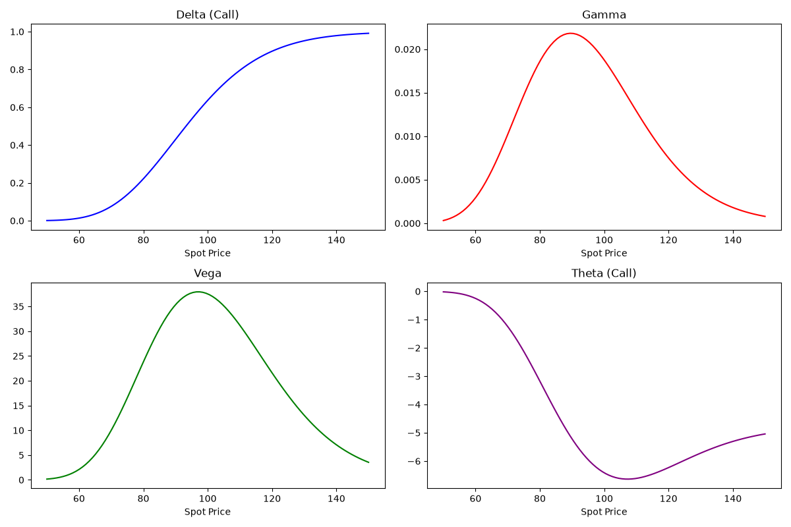

# Options Pricing Engine

A modular, high-performance quantitative finance library written in Python to price European and American vanilla options. The engine implements analytical closed-form solutions (Black-Scholes-Merton with full first- and second-order Greeks) and benchmarks them against numerical lattice methods (Cox-Ross-Rubinstein Binomial Tree) and stochastic simulations (Geometric Brownian Motion Monte Carlo with variance reduction).

---

## Key Features

- **Black-Scholes-Merton Closed-Form Engine**:
  - Exact analytical valuation for European calls and puts.
  - Closed-form computation of primary first- and second-order Greeks: Delta ($\Delta$), Gamma ($\Gamma$), Vega ($\nu$), Theta ($\Theta$), and Rho ($\rho$).
  - Built-in validation via Put-Call parity.
- **Cox-Ross-Rubinstein (CRR) Binomial Tree**:
  - Memory-efficient $O(N)$ 1D array backward induction.
  - Supports both **European** expiration and **American** early-exercise payoff evaluation.
  - Numerical convergence to Black-Scholes as step count $N \to \infty$.
- **Vectorized Monte Carlo Simulator**:
  - Risk-neutral terminal price simulation under Geometric Brownian Motion (GBM).
  - Fully vectorized NumPy execution with **antithetic variates** for variance reduction.
  - Dynamic 95% and 99% confidence interval error bounds via standard error estimation.
- **Visualization Suite**:
  - Multi-panel sensitivity profiles tracking Delta, Gamma, Vega, and Theta across spot prices.
  - Simulation path distributions and Monte Carlo convergence curves.
- **Automated Test Suite**:
  - `pytest` validation suite checking put-call parity identity and convergence tolerance bounds across all three engines.

## Visualizations

### Greeks Sensitivity Profiles
Analytical first- and second-order sensitivities evaluated across spot prices ($S \in [50, 150]$) for strike $K = 100$:

  

- **Delta ($\Delta$)**: Sigmoidal transition from $0.0$ (deep OTM) to $1.0$ (deep ITM), crossing $\approx 0.5$ at-the-money[cite: 10, 15].
- **Gamma ($\Gamma$)**: Symmetric bell curve peaking at $S = K = 100$, indicating maximum curvature and hedging sensitivity near the strike[cite: 10, 15].
- **Vega ($\nu$)**: Bell-shaped volatility sensitivity centered at ATM, reflecting maximum time-value responsiveness to implied volatility shifts[cite: 10, 15].
- **Theta ($\Theta$)**: Deepest negative decay near at-the-money, capturing accelerated premium erosion[cite: 10, 15].

